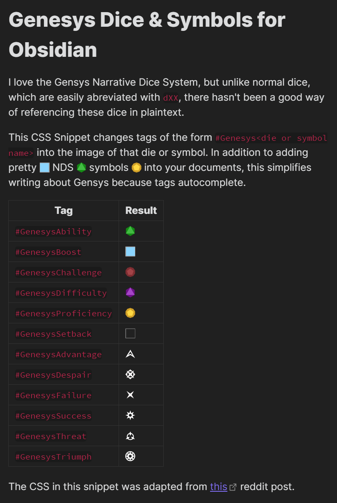

# Obsidian Genesys

Here is a compilation of various Obsidian tools useful for the Genesys RPG. At the moment, that's just my Genesys Dice css snippet, but if you have something to add, please make a pull request adding it to the list. 

## Genesys Dice

The Genesys Dice snippet converts tags like `#GenesysProficiency`, `#GenesysSuccess` to dice images in Obsidian. If you want to see it in action, [install the snippet]("#To Install"), then [put this md file in your vault](./examples/GenesysDiceExample.md). It should look like this screenshot:

This snippet does have some slight support for the Style Settings community plugin, but is functional without it.

### To Install

1. Copy paste [this snippet](./snippets/GenesysDice/GenesysDice.css) into the `.obsidian/snippets/` folder of your vault
2. Navigate to `Settings` → `Appearance` → `Reload Snippets`, then enable the snippet.
3. You may also have to add a theme fix snippet if you aren't using the default Obsidian theme. If a theme fixing snippet doesn't exist, create an Issue and I'll see about creating one (or, if you create your own fix, make a pull request and I'll add it to the collection).
