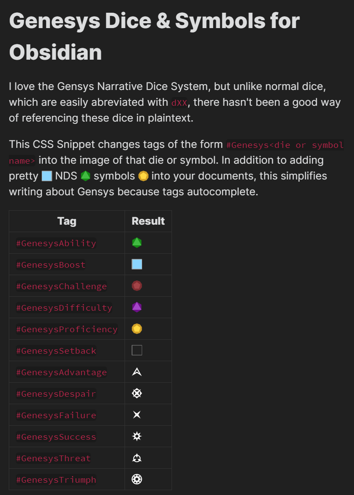

# Obsidian Star Wars/Genesys

Here is a compilation of various Obsidian tools useful for the Genesys RPG (and Fantasy Flight Games' Star Wars RPG, but that has lower priority). 
At the moment, we've got a [CSS snippet](https://github.com/Craftidore/Obsidian-Genesys/tree/master/Dice-Snippets) for putting Star Wars and Genesys dice images into your notes and a Star Wars/Genesys statblock layout for the [Obsidian TTRPG Statblocks](https://github.com/valentine195/obsidian-5e-statblocks) plugin. 
If you have something else to add, please make a pull request adding the code and instructions on how to install/use it as it's own folder.

## Star Wars and Genesys Dice

The Star Wars and Genesys Dice snippets convert tags like `#StarWarsProficiency`/`#GenesysProficiency`, `#StarWarsSuccess`/`#GenesysSuccess` to dice images in Obsidian. 
If you want to see it in action, <a href="https://github.com/Craftidore/Obsidian-Genesys/tree/master/Dice-Snippets#to-install">install</a> the snippet.

## Star Wars and Genesys TTRPG Statblock Layout

More info can be found [here](https://github.com/Craftidore/Obsidian-Genesys/tree/master/TTRPG-Statblock-Layout)
